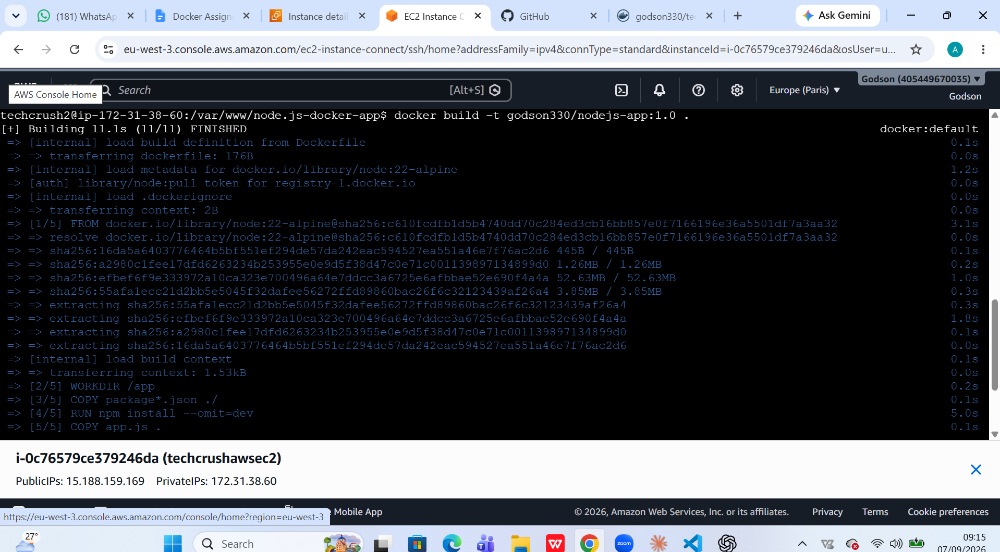
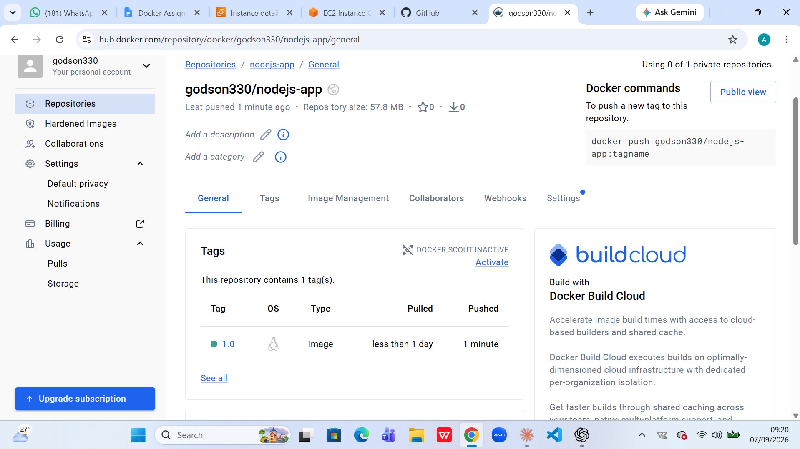
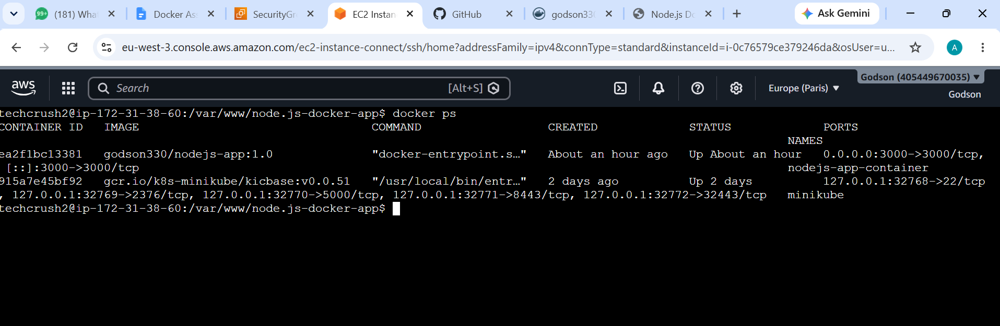
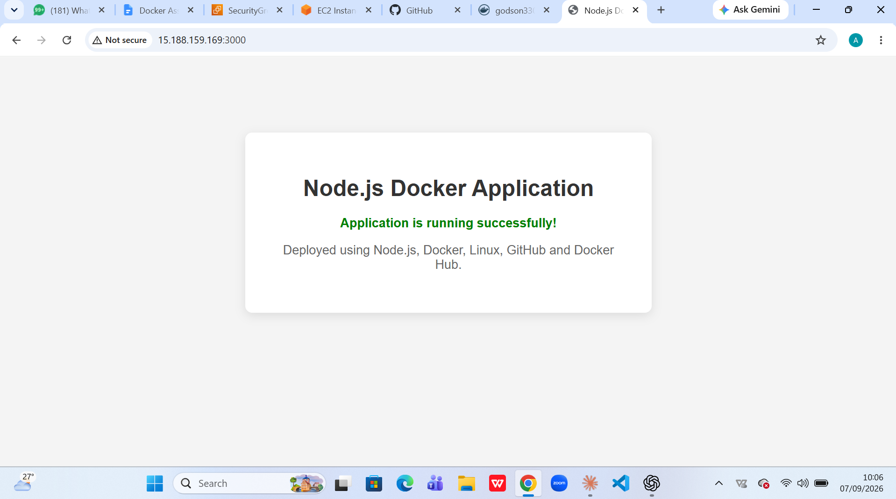

# Node.js & Docker Deployment

## Project Overview

This project is a simple Node.js web application deployed using Linux, Docker, GitHub, and Docker Hub.

The application runs on port **3000** and displays a simple success message when accessed through a web browser.

## Technologies Used

* Node.js
* Express.js
* Docker
* Docker Hub
* GitHub
* Linux

## Project Files

```text
nodejs-docker-app/
├── app.js
├── package.json
├── package-lock.json
├── Dockerfile
├── .dockerignore
└── README.md
```

## Application

The Node.js application uses Express.js and listens on port 3000.

To run the application directly with Node.js:

```bash
npm install
npm start
```

The application can then be accessed at:

```text
http://SERVER-IP:3000
```

## Docker Build

The Docker image was built using:

```bash
docker build -t godson330/nodejs-app:1.0 .
```

### Docker Build Screenshot



## Docker Hub

The Docker image was pushed to my Docker Hub repository using:

```bash
docker push godson330/nodejs-app:1.0
```

### Docker Hub Screenshot



## Running Docker Container

The container was started using:

```bash
docker run -d --name nodejs-app-container -p 3000:3000 godson330/nodejs-app:1.0
```

The running container was verified using:

```bash
docker ps
```

### Running Container Screenshot



## Live Application

The application was accessed through a web browser using:

```text
http://SERVER-IP:3000
```

### Live Application Screenshot



## Conclusion

The Node.js application was successfully built, containerized with Docker, pushed to Docker Hub, pulled from Docker Hub, and deployed as a running Docker container on a Linux server.

